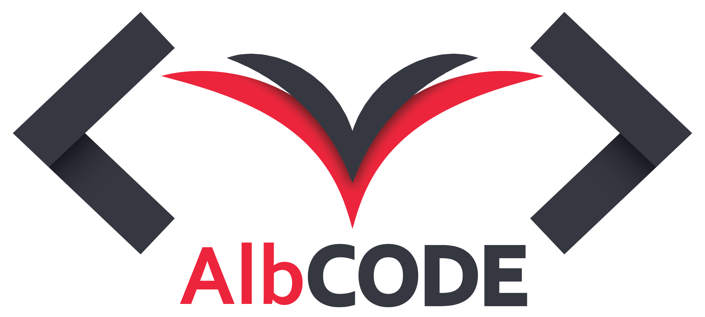

**Albcode Logo concept**
 
Is a composition of a simplified version of the Albanian flag symbol and brackets, a common char in tags of web development.

The Logo is designed to be used as a Logotype as well as an Iconic Symbol.

The Iconic elements were composed of flat illustations. Shadows were used to provide the illusion of depth.

The main focus while designing it was to provide something functional for the ALbCode Team.

Credits: **Kristjano Monka**

Behance: https://www.behance.net/KristjanoMonka

